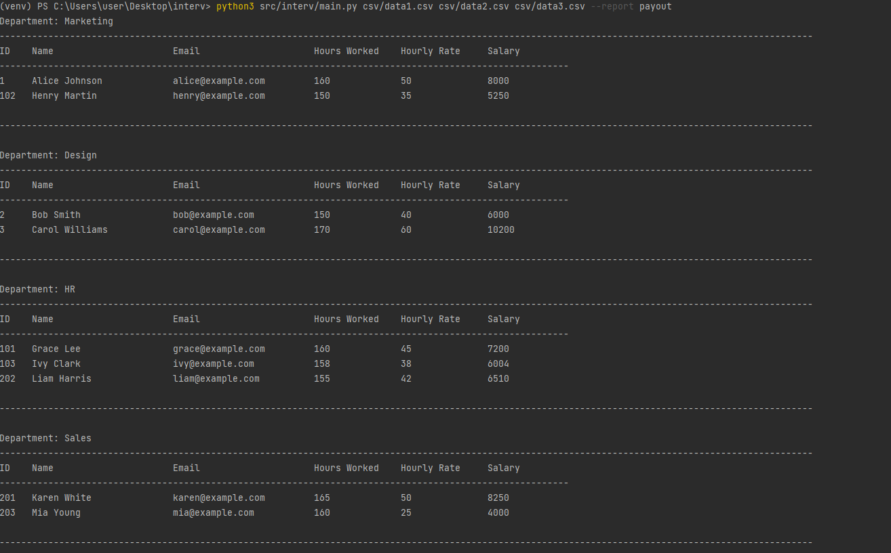
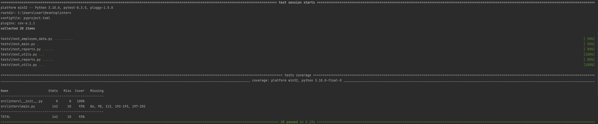

# 📊 Скрипт для генерации отчетов по сотрудникам

Инструмент командной строки для обработки CSV и JSON файлов с данными сотрудников и генерации различных отчетов — таких как расчёт зарплат и средней ставки по отделам. Работает **только на стандартной библиотеке**, без внешних зависимостей.

---

## 🚀 Быстрый старт

1. (Опционально) Установите виртуальное окружение:

```bash
python -m venv venv
# Windows:
venv\Scripts\activate
# macOS / Linux:
source venv/bin/activate
```

2. Запустите скрипт, передав пути к CSV и/или JSON файлам и тип отчета:

```bash
python main.py csv/data1.csv csv/workers.json --report payout
```

---

## 📁 Структура проекта

```
├── csv/
│   ├── data1.csv
│   ├── data2.csv
│   ├── data3.csv
│   └── workers.json
├── src/
│   └── interv/
│      ├── __init__.py
│      └── main.py
├── tests/
│   ├── __init__.py
│   ├── test_employee_data.py
│   ├── test_main.py
│   ├── test_reports.py
│   └── test_utils.py
└── README.md
```

---

## 📌 Доступные отчеты

| Название               | Описание                                                  |
|------------------------|------------------------------------------------------------|
| `payout`               | Расчет заработной платы по отделам (часы × ставка)         |
| `average_hourly_rate`  | Средняя почасовая ставка по каждому отделу                |


## 🧩 Как добавить новый отчет

1. Откройте `ReportGenerator` в `main.py`.

2. Добавьте новый метод, например:

```python
def generate_overtime_report(self):
    # реализация отчета
```

3. Зарегистрируйте его в `self.available_reports`:

```python
self.available_reports = {
    'payout': self.generate_payout_report,
    'average_hourly_rate': self.generate_average_hourly_rate_report,
    'overtime': self.generate_overtime_report  # ⬅️ новый отчет
}
```

4. Запуск:

```bash
python main.py csv/data1.csv --report overtime
```

---

## 🛠 Обработка ошибок

- ⚠️ Проверка существования переданных файлов.
- ⚠️ Проверка корректности типа отчета — с выводом доступных значений.
- ⚠️ Обработка неполных или некорректных данных.
- ✅ Сообщения об ошибках выводятся в консоль с понятным описанием.

---

## 📌 Особенности

- 📂 Поддержка CSV и JSON
- 🧩 Без сторонних библиотек (`pandas`, `csv`, и т.п.)
- 🧱 Расширяемая архитектура: легко добавлять новые типы отчетов
- 📊 Унифицированная структура данных после стандартизации

---

## ✅ Пример вывода (`payout`)

```
Department: Sales
---------------------------------------------------------------------------------------------
ID    Name                     Email                    Hours Worked   Hourly Rate   Salary
---------------------------------------------------------------------------------------------
201   Karen White              karen@example.com        165            50            8250
...
---------------------------------------------------------------------------------------------
```

---

## 🧪 Тестирование

Тесты написаны с использованием `pytest`. Для запуска:

```bash
pip install pytest pytest-cov
pytest --cov=src/interv 
```
---
- Процент покрытия тестами:

- 
---
